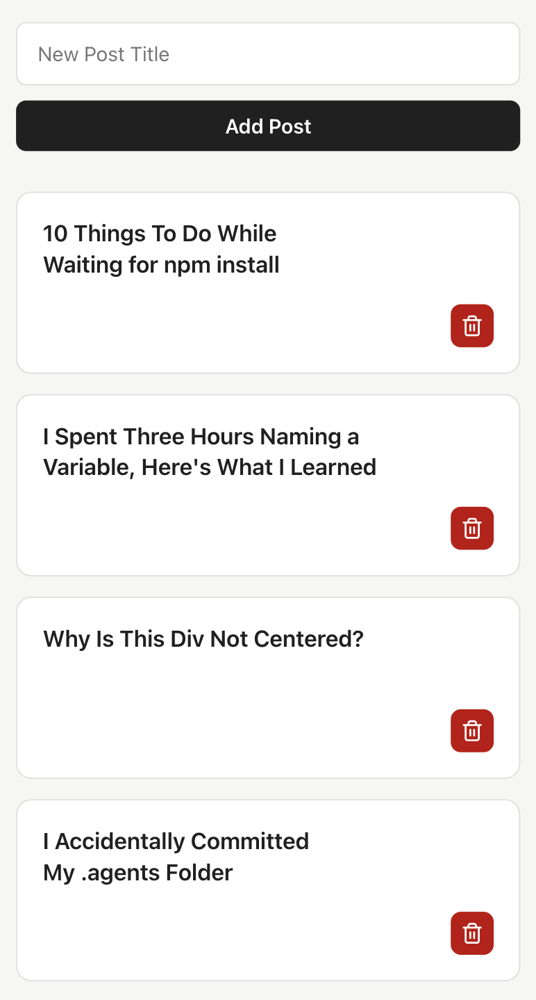

# React Blog Form

A React data binding exercise from my web dev course. It asks to build a small blog interface where posts can be displayed, added, and deleted.



## Exercise

Given an initial list of blog posts:

- render the title of each post;
- add new posts through a controlled form input;
- update the list when the form is submitted;
- allow posts to be deleted with an icon;
- organize the interface into multiple components.

## Solution

The main state and post handlers are in [`src/App.jsx`](./src/App.jsx). The form is managed by [`PostForm`](./src/components/PostForm.jsx), while [`PostList`](./src/components/PostList.jsx) and [`Post`](./src/components/Post.jsx) render the responsive card grid and individual posts.

## Run locally

- Clone the repo `https://github.com/emanuelefavero/react-form.git`
- `cd` into the project folder
- Run:

  ```bash
  npm install
  npm run dev
  ```

- Open `http://localhost:5173` in your browser to see the app.
